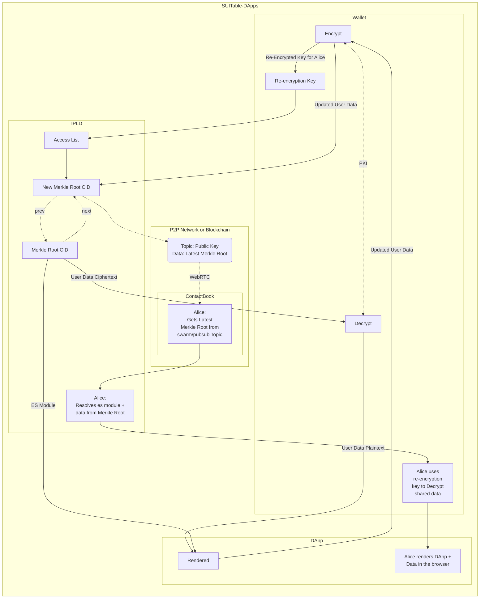

### Hi there 👋

- 🔭 Love working on Web3, DWeb, decentralized peer-2-peer tech
- 🌱 I hack on ipfs, ipld hypercore, arweave, and solana
- 👯 I’m looking to collaborate on anything with the above
- 📫 How to reach me: @douganderson444 anywhere that counts
- 😄 Pronouns: he/him

Currently working on Self-Updating Internet Technology enabled Decentralized Apps (SUITable DApps, for short).
<!--

-->
<!--
**DougAnderson444/DougAnderson444** is a ✨ _special_ ✨ repository because its `README.md` (this file) appears on your GitHub profile.

Here are some ideas to get you started:

- 🔭 I’m currently working on ...
- 🌱 I’m currently learning ...
- 👯 I’m looking to collaborate on ...
- 🤔 I’m looking for help with ...
- 💬 Ask me about ...
- 📫 How to reach me: ...
- 😄 Pronouns: ...
- ⚡ Fun fact: ...
-->
